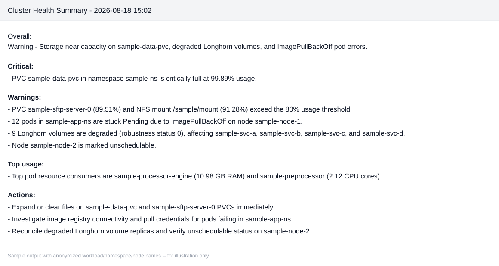

# Cluster Monitor AI

Query Prometheus for Kubernetes cluster health, ask Google Gemini (free tier)
to turn the raw metrics into a concise operations summary, and email the
result. One plain script -- schedule it with cron / Task Scheduler / a
Kubernetes CronJob for periodic reports.

## Features

- Collects ~24 PromQL queries covering node health, pod health, CPU/memory,
  disk & PVC usage, network errors, API server/etcd, certificate expiry, and
  Longhorn volumes.
- Sends the collected metrics to Gemini and gets back a plain-text,
  email-ready summary (Overall / Critical / Warnings / Top usage / Actions).
  Prints the exact prompt sent to Gemini so you can see what it's basing the
  summary on.
- Automatic Gemini model fallback: tries a ranked list of current Flash
  models and falls through if one is unavailable for your API key.
- **Multi-SMTP support**: one or more servers with automatic fallover,
  optional authentication (works with or without a username/password), and
  optional STARTTLS / implicit SSL / no encryption -- see
  [SMTP configuration](#smtp-configuration).
- `--dry-run` and `--no-ai` flags for safe local testing.
- Small retry-with-backoff on Prometheus and Gemini calls so one transient
  network blip doesn't ruin the report.
- Single file, minimal dependencies (`requests` + `google-genai`), no
  framework or package structure.

## Sample output

Here's what a resulting email summary looks like (workload/namespace/node
names below are anonymized placeholders, not real cluster data):



## Installation

```bash
pip install -r requirements.txt
cp .env.example .env
# edit .env with your Prometheus URL, Gemini API key, and SMTP settings
```

## Usage

```bash
python script.py                 # collect, summarize, and email
python script.py --dry-run       # collect + summarize, skip sending email
python script.py --no-ai         # email raw metrics, skip the Gemini call
```

Schedule it (example: every 30 minutes with cron):

```
*/30 * * * * cd /opt/cluster-monitor && python3 script.py >> /var/log/cluster-monitor.log 2>&1
```

## Configuration

All configuration is via environment variables, loaded from `.env` by
default (real environment variables always take precedence over `.env`).
See [`.env.example`](.env.example) for the full annotated list. Key
variables:

| Variable | Required | Default | Description |
| --- | --- | --- | --- |
| `PROMETHEUS_URL` | yes | -- | Base URL of your Prometheus server. |
| `GEMINI_API_KEY` | yes | -- | Google Gemini API key (free tier works). |
| `GEMINI_MODEL` | no | `auto` | Pin a model name, or `auto` to rank + fall back. |
| `MAX_ROWS_PER_QUERY` | no | `30` | Caps rows per PromQL result sent to the LLM. |
| `SMTP_SERVER` | yes | -- | One host or comma-separated `host[:port]` list. |
| `SMTP_PORT` | no | `25` | Default port when not given per-host. |
| `SMTP_SECURITY` | no | `none` | `none`, `starttls`, or `ssl`. |
| `SMTP_USER` / `SMTP_PASS` | no | unset | Both set = authenticate; both unset = no-auth relay. |
| `EMAIL_USER` | yes | -- | From address. |
| `EMAIL_TO` | yes | -- | Comma-separated recipient list. |

### SMTP configuration

`SMTP_SERVER` can list several targets (comma-separated `host[:port]`),
tried in order until one send succeeds -- useful for a primary + backup
relay.

**Open internal relay, no password (the common in-cluster case):**

```
SMTP_SERVER=127.0.0.1
SMTP_PORT=25
SMTP_SECURITY=none
SMTP_USER=
SMTP_PASS=
```

**Authenticated provider over STARTTLS (Gmail, Office365, etc.):**

```
SMTP_SERVER=smtp.gmail.com
SMTP_PORT=587
SMTP_SECURITY=starttls
SMTP_USER=you@gmail.com
SMTP_PASS=your-app-password
```

**Authenticated provider over implicit SSL (port 465):**

```
SMTP_SERVER=smtp.example.com
SMTP_PORT=465
SMTP_SECURITY=ssl
SMTP_USER=alerts@example.com
SMTP_PASS=your-password
```

**Primary + fallback relay, both unauthenticated:**

```
SMTP_SERVER=mail1.internal.local,mail2.internal.local:2525
```

`SMTP_USER` and `SMTP_PASS` must either both be set or both be left unset --
the script exits with a clear error at startup on a partial auth
configuration, rather than failing silently at send time.

## Security notes

- `.env` is git-ignored; never commit real credentials. Use `.env.example`
  as the template.
- The email body is transmitted as 7-bit ASCII to avoid corruption on relays
  that mishandle quoted-printable/base64 transfer encoding; non-ASCII
  characters are replaced rather than silently mangled.

## License

[MIT](LICENSE)
